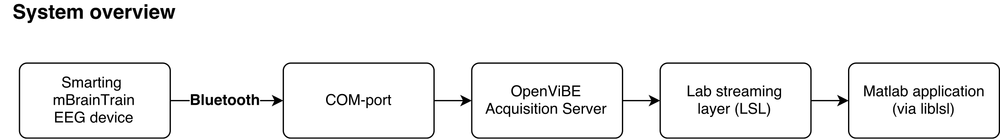
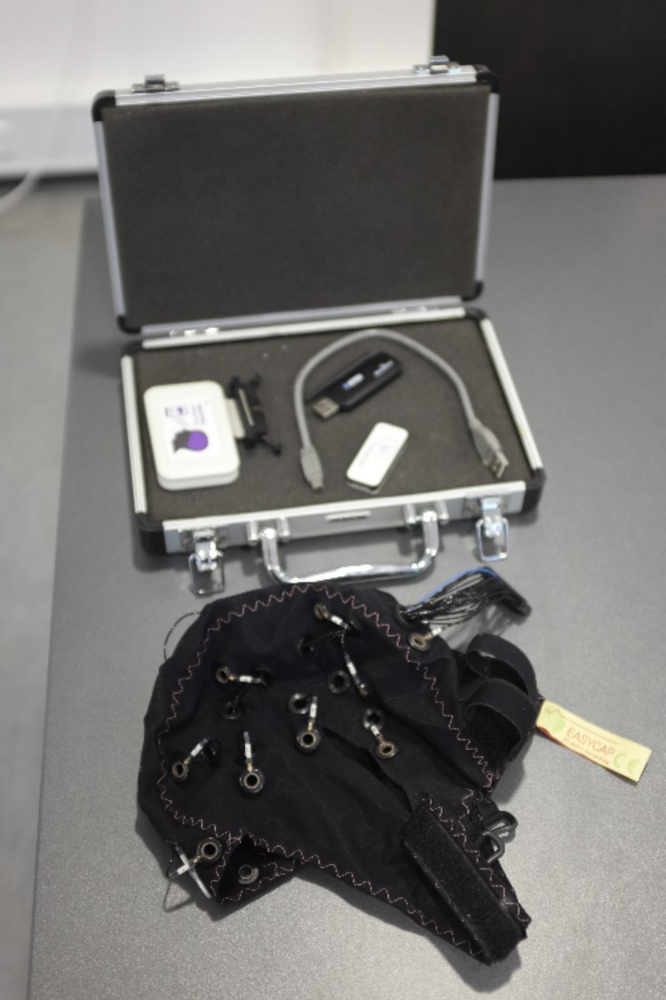
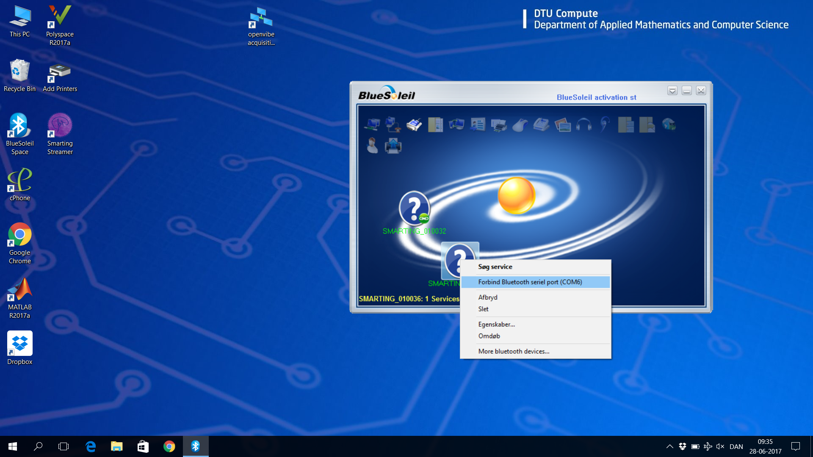
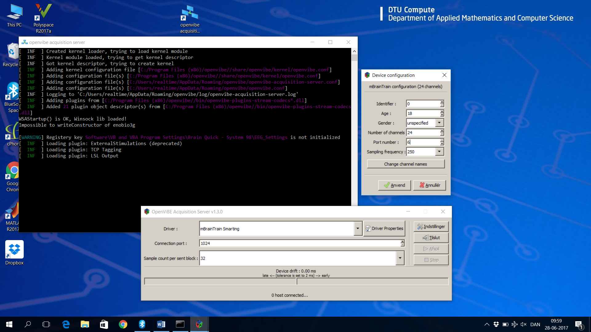
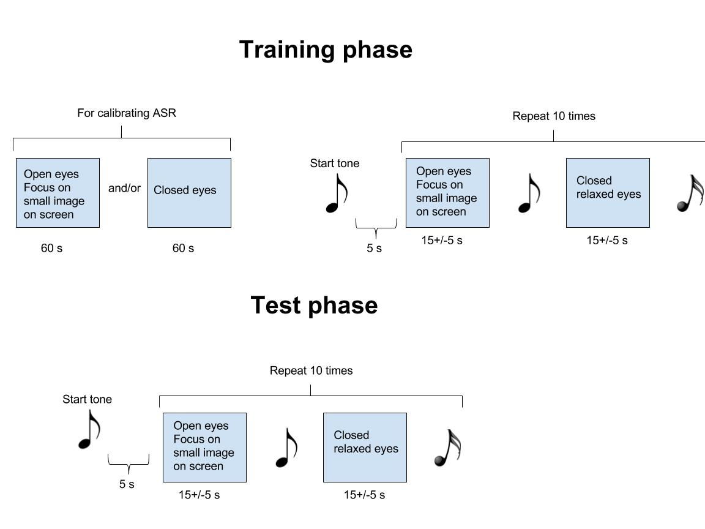
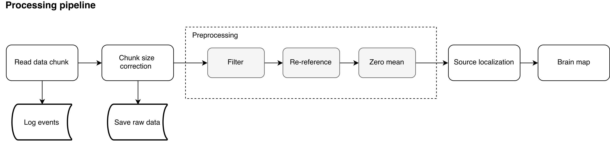

# Real-time EEG source localization and classification

<!-- # Introduction -->
In the following we describe a framework for performing real-time EEG source localization and classification. The program was developed at the Technical University of Denmark (DTU Compute) and can be used when recording EEG signals from a Smarting mBrainTrain EEG device. The developed program performs and visualizes source localization in real-time as well as provides real-time task classification.
Currently only Windows is supported.

## System
The used equipment is an EEG headset from Smarting mBrainTrain which connects to the PC via Bluetooth.
Device specifics:
- Sample rate: 250 Hz (500 Hz is also possible)
- 24 sensor EEG cap from EasyCap (https://www.mbraintrain.com/wp-content/uploads/2016/01/RBE-24-STD_legacy.pdf)

<!-- **System overview** -->

<!--- - [ ] insert figure of headset-->

The headset connects to a computer via Bluetooth using a BlueSoleil Bluetooth dongle that makes the device available as a Serial COM interface. See [mBrainTrain user manual](https://mbraintrain.com/wp-content/uploads/2016/08/SMARTING-User-Manual.pdf) for more details.

Using the OpenVIBE Acquisition Server, the data is sampled from the EEG device and made available through lab streaming layer ([LSL](https://github.com/sccn/labstreaminglayer)). By using the [lab streaming layer library for Matlab](https://github.com/sccn/labstreaminglayer/tree/master/LSL/liblsl-Matlab) the data is read into the Matlab application.

### Installation
Install the following programs
 - BlueSoleil Bluetooth driver (can be found on the accompanying USB drive, not the Bluetooth dongle)
 - OpenViBE [http://openvibe.inria.fr/downloads/](http://openvibe.inria.fr/downloads/). Replace the default OpenViBE Acquisition Server config file with the one supplied in this folder. Otherwise make sure that the driver settings are correct every time the OpenViBE Acquisition Server is started. To replace the file move *openvibe-acquisition-server.conf* to *C:\Users\[username]\AppData\Roaming\openvibe*
 <!-- - Lab streaming layer  -->
 - Clone or download this repository
 - Install PsychoPy (http://www.psychopy.org/about/overview.html), NumPy, SciPy for creating and running stimulation files.

### Setting up the connection
More information can be found in the mBrainTrain user manual (see [user manual](https://mbraintrain.com/wp-content/uploads/2016/08/SMARTING-User-Manual.pdf)).

#### Setting up the Bluetooth connection:
Insert Bluetooth dongle and open "BlueSoleil Space". Connect to the smarting device by right clicking on the question mark (the dongle can only be matched with a specific EEG amplifier) and choose "Connect to Bluetooth serial port (COMX)". Make a note of the serial port number (e.g. "COM6" as in the below figure). Disconnect the seriel port by first right clicking on the question mark and choose "Disconnect Bluetooth serial port (COM6)".

#### Using SmartingStreamer for impedance measurements 
Open the Smarting Streamer and click connect. Choose the correct serial port and press the orange connect button. Start by clicking "Measure impedence on ref" and click "start streaming signals". Fill gel into the ground electrode and the reference electrode and see the color of the reference channel change from red to green. Click "stop streaming signals" and choose "Measure impedance" and "Select Channels" followed by "start streaming signals". When the electrodes have changed from red to green you are ready to view the EEG signal (click "show signals"). There will be an artefact from the impedance measurement if you have not changed to "No impendance measurement".
When you are satisfied with the impedances click disconnect in the top and close SmartingStreamer.

A video guide to setting up the guide can be found here https://www.youtube.com/watch?v=nWBARTdZ0e8.

#### Setting up the OpenViBE connection
Open the "openvibe acquisition server". Click "Driver Properties" and change the port number to the serial port number noted earlier, press Enter before clicking Apply (otherwise the change will not be saved). This step has to be conducted even though the openvibe-acquisition-server.conf file has been replaced. Click "Connect" and "Play".

#### Using the BrainScanner GUI
Open Matlab and go to the brainscanner folder. Type "BrainScanner" in the Command window. Click "Connect headset" and then "Start/stop". 

##### The Visualization window
Preprocessing steps of the visualized data can be activated by clicking (in the "Visualization" square) 
- "Filter": bandpass filters the data to [1,45] Hz).
- "Rereference": changes the montage to have average reference.
- "ASR": performs artifact removal by artifact subspace reconstruction (Mullen 2015). ASR can only be activated if a data file has been loaded by clicking "Load ASR data". This button both imports data for ASR and trains the ASR model. Note that the ASR is trained with the preprocessing steps chosen in the "Visualization" square.

"Plot data" will show the EEG signal with the chosen preprocessing settings.
"Plot brain" will perform source localization using teVG (Hansen 2013, 2014) and then shows the localized cortical activitions. If teVG has been trained it will use the sparsity parameter obtained otherwise it will use a predefined value.

"Train VG" is best performed when the headset is not connected. Load the existing EEG file you wish to use for training the VG parameter by clicking "Load file" in the "EEG data source" window. Choose the desired settings for training the VG model in the visualization window. Normally, at least the filter and rereference options should be chosen. Click "Train VG" and then "Start/stop". The parameter estimation will take some time, depending on the length of the inputtet EEG data. A mat-file called "gamma" will be saved. Remember to rename or remove this file if you do not wish to use it as input for "Plot brain". 

The forward model used in both "Plot brain" and "Train VG" was constructed in BrainStorm using a the ICBM152 template and was build using OPENMEEG BEM headmodelling (Gramfort, 2010).

##### The Experiment window
Classification is performed after a classification model has been trained. The training will be conducted using the preprocessing options chosen in the experiment window. Normally at least "Filter" should be chosen (if the classification model uses source localization the "Rereference" option should also be chosen"). If ASR is needed then load a suitable data set for this and the click ASR (in the "Experiment" window). When the desired options have been chosen, then click "Train Model" ("Start/stop" should be off). First the user is asked if source localization should be performed. If "1" is typed VG will train the sparsity parameter regardless if this has already been done in "Train VG".
A stimulation file and an EEG data file will then be requested and finally the user will be asked whether the EEG data should be delayed with respect to the stimuli file. When the model is done training turn "Start/stop" on, classification will then begin automatically and the predicted stimulation is stored in "predicted_stim.mat". Remember to remove or rename this file before a new run. The classification model applies Matlab’s build-in function “fitglm” to train a generalized linear model using a binomial distribution.

The classification model is build towards classifying open vs. closed eyes. Filtering is e.g. set to [5,15] Hz and the electrodes of interest are O1 and O2 (if source localization is not chosen).

##### Common warnings encountered in the BrainScanner app
The command window will display "input:noData" if the buffer does not contain data. Most of the times this just means that data was requested before new data was available. If you look in the log-file you often see that an empty data block is followed by a full data block (of e.g. 32 samples) and that a block of samples are in the buffer. The buffered data will be used/saved in the next iteration. 

To minimize disruption of data streaming have as few programs active as possible, and use the "Airplane mode" of the PC.

The message "input:shortBlock" will be displayed if less samples than the predetermined blocksize are available. This happens occasionaly and the system handles it by throwing away these samples. This favors realtime applications but will cause small shifts in the saved data with respect to timing and will thus affect offline analysis. This could be avoided by saving all data points.

##### Output files
Two files are generated and updated while "Save data" is on. 
"raw_date time.csv" contains the raw data, i.e. no preprocessing has been done on this data. In addition to the EEG signal a relative time stamp is stored for each time sample.
"logdate time.csv" contains the blocksize which is however many samples was extracted from the buffer, bufferBlockSize contains how many samples remain in the buffer. "UpdateDuration" contain how many seconds a block extraction took. This file is mostly used for error checking.

### Running an open/closed eyes experiment

- Turn on "Airplane mode"
- Connect and disconnect to the correct EEG amplifier using BlueSoleil, open SmartStreaming and fill gel in electrodes while checking impedances. Disconnect SmartingStreaming and start streaming through OpenVibe. See above for more details.
- Open BrainScanner in Matlab and connect headset and start streaming.
- Save 1 minute of data while the subject has open eyes while minimzing the amount of artifacts.
- Run and save an experiment training run.
- Set "Start/stop" to off.
- In the experiment window click "Filter", "Rereference", "Load ASR file" (choose the EEG data containing the 1 minute of data) and then click "ASR".
- Turn "Start/stop" off.
- Click "Train Model", type "1" in the command window for extracting features from source localization, choose the stimulation and EEG file used in the experiment training run. Delay by 5 seconds.
- When the training is completed turn on "Start/stop" this will now output "Closed eyes" or "Open eyes" in the Command window. The calculated probality of closed eyes is also outputtet.
- To save a test run start saving EEG data at the same time as a stimulation file is run.

### Data processing
The core processing is handled by the function <tt>processData()</tt> in <tt>EEGStreamer.m</tt>. This includes reading data from the device (or playback from an earlier recording), pre-processing, source localization, visualization, and data logging. 

The function is invoked periodically by a Matlab timer running with a fixed interval of 128ms. The timer is activated/deactivated by pressing the start/stop button in the graphical user interface. Note that if the function <tt>processData()</tt> is the still running when the timer is activated, the next call to the function will be dropped without notice. For example, this can happen if the execution time of <tt>processData()</tt> exceeds the timer interval (128ms).

The system is designed to operate on data in blocks of 32 samples (128ms). However, it is not always the case that there is exactly 32 samples available from the device and therefore the function <tt>chunkSizeCorrection()</tt> ensures that there is always exactly 32 samples available for subsequent processing. For example, it happens occasionally that there are 0 samples available when the application pulls data from the device and then 64 samples in the next round. In this case, <tt>chunkSizeCorrection()</tt> will divide the 64 samples into two block of 32 samples each. For more details, see implementation of <tt>chunkSizeCorrection()</tt>.

### Reading data

**"Data buffer"**

The data is read into a pseudo-buffer with a buffer size of 64 samples equal to two blocks (of each 32 samples) from the OpenViBE Acquisition Server.

## The stimuli script
The stimuli folder contains a script that handles the execution of the experimental paradigm, i.e. the script play sounds to indicate when the subject should open and close his/her eyes. The script is written in Python using the Psychopy module. The images shown to the subjects should be located in the stimuli/images directory. 

The script also outputs a file that contains information about the experimental paradigm, i.e. open/closed eyes vs time (0=open eyes, 1 = closed eyes). 

While using the Psychopy script on a Dell Latitude E7440 laptop, we observed that the script crashes if the volume up/down buttons were pushed during execution of the script.

## Real-time Matlab application
The Matlab [application](https://github.com/realtimebrainscanner/brainscanner/blob/master/BrainScanner.m)

### Brain plotting

## References
Mullen, T., Kothe, C., Chi, M., Ojeda, A., Kerth, T., Makeig, S., … Cauwenberghs, G. (2015). Real-time Neuroimaging and Cognitive Monitoring Using Wearable Dry EEG. IEEE Transactions on Biomedical Engineering, 62(11), 2553–2567. http://doi.org/10.1109/TBME.2015.2481482

Hansen, S. T., Stahlhut, C., & Hansen, L. K. (2013). Expansion of the Variational Garrote to a Multiple Measurement Vectors Model. In Twelfth Scandinavian Conference on Artificial Intelligence (pp. 105–114). Retrieved from http://scholar.google.com/scholar?hl=en&btnG=Search&q=intitle:Expansion+of+the+Variational+Garrote+to+a+Multiple+Measurement+Vectors+Model#0

Hansen, S. T., & Hansen, L. K. (2014). EEG source reconstruction using sparse basis function representations. In 2014 International Workshop on Pattern Recognition in Neuroimaging (pp. 1–4). IEEE. http://doi.org/10.1109/PRNI.2014.6858521

Gramfort, A., Papadopoulo, T., Olivi, E., & Clerc, M. (2010). OpenMEEG: opensource software for quasistatic bioelectromagnetics. Biomedical Engineering Online, 9(1), 45. http://doi.org/10.1186/1475-925X-9-45

## Acknowledgment

This work is supported by

[BaSiCs project by DTU and DRCMR](http://www.drcmr.dk/basics)

**Furthermore, we would like to give credit to**

- Carsten Stahlhult for the initial brain plotting functions and more
- labstreaminglayer
